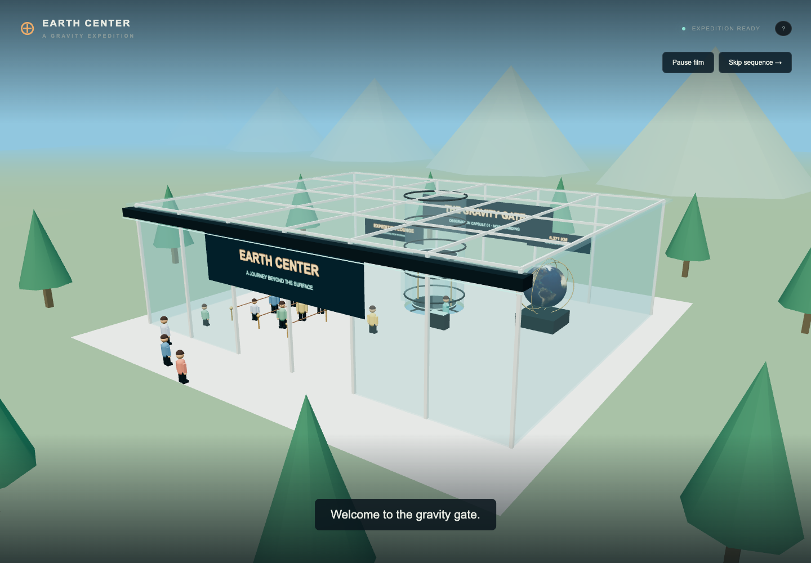
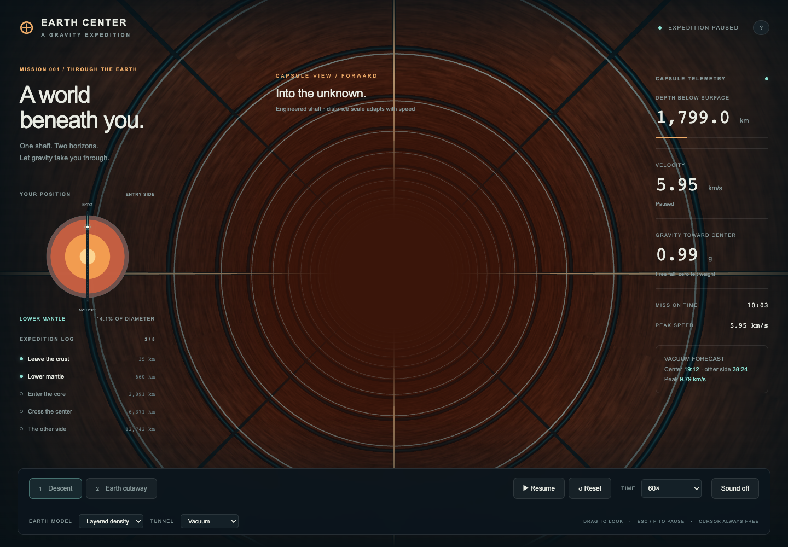
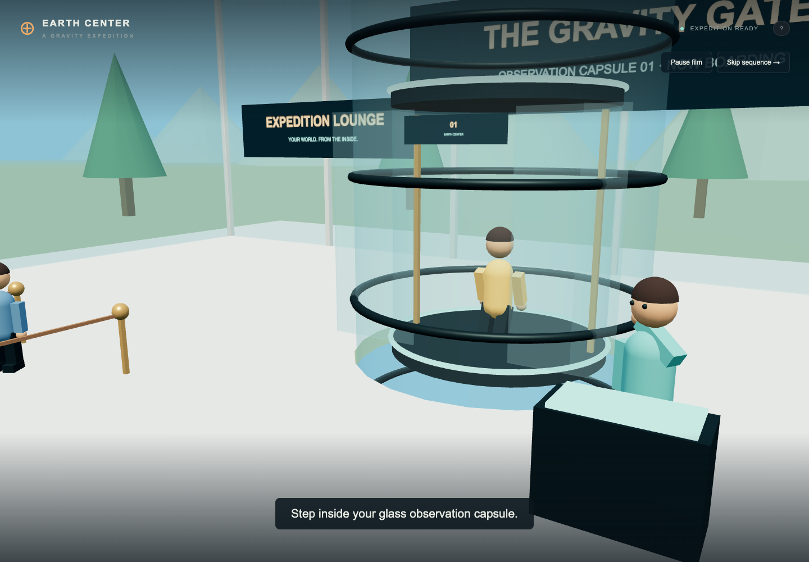

# Earth Center

**One shaft. Two horizons. Let gravity take you through.**

A playable gravity expedition through a hole spanning Earth's diameter. Release your capsule, descend through the mantle and core, cross the center, and rise toward the opposite surface. Switch between the capsule's view down the shaft and a planetary cutaway while watching the physics unfold.



## Play locally

Requirements: Python 3 and a desktop browser with WebGL support. Tested in Chrome. Libraries and textures are bundled, so no installation of JavaScript dependencies or build step is required.

```bash
git clone https://github.com/timtoole02/Earth-Center.git
cd Earth-Center
python3 -m http.server 8082 --bind 127.0.0.1
```

Open **[http://localhost:8082](http://localhost:8082)**. On Windows use `py -3` instead of `python3`. With Node/npm installed, `npm start` runs the same Python server. You can also download the repository ZIP and run the server from the extracted directory.

Use HTTP rather than opening `index.html` directly. Change the port in both the command and the address if 8082 is occupied. Stop the server with Ctrl+C.

## Your expedition

1. Watch the space-to-Earth arrival or skip to the visitor complex. Choose **Layered density** or **Uniform density**, and **Vacuum** or **Controlled air**.
2. Select **Start dive** to enter the themed queue. Your character boards a glass capsule, the doors close, and it lowers to the release hatch before the fall begins.
3. Look through the transparent observation tube at fractured rock, mineral clusters, glowing mantle seams, flowing outer-core metal, and a crystalline inner-core illustration. Drag sideways for a closer look. Switch to **Earth cutaway** to see your position across the entire planet.
4. Reach the five expedition milestones. At the far surface, the vacuum expedition pauses at the turning point.
5. Select **Keep falling** to release the surface catch and fall back again, or start a new experiment.



The 12-second arrival and 11-second boarding sequence are skippable. **Escape** skips arrival to the terminal; during boarding, it enters the game paused. **Skip sequence** during boarding goes straight to the active fall. **P** or **Pause film** pauses the cinematic. **Replay arrival** starts the visit again.

Look up in the crust: an absurdly large buried alien vessel has an estimated in-world length of **160 km (about 100 miles)**. The first inbound encounter briefly limits playback to 10×, then restores your selected rate. It is a fictional easter egg; its geometry uses the same compressed visual scale as the surrounding geology. The onboard survey team insists it is “definitely a rock.”



## Controls

| Input                          | Action                                                |
| ------------------------------ | ----------------------------------------------------- |
| Start dive / Space             | Start the boarding sequence                           |
| 1                              | Capsule descent view                                  |
| 2                              | Earth cutaway view                                    |
| Left mouse button + drag       | Look around the scene                                 |
| **Escape / P**                 | **Pause immediately**                                 |
| Pause / Resume button          | Stop or resume the simulation                         |
| Space while playing            | Toggle pause when keyboard focus is on the scene/page |
| Time selector                  | 1× real time, 10×, 60×, or 240×                       |
| Earth model / Tunnel selectors | Change the experiment and reset it                    |
| Reset                          | Return to the starting surface                        |
| Sound                          | Toggle synthesized capsule ambience                   |
| ?                              | Open the science and controls guide                   |

The cursor is always free; pointer lock is never requested. Changing tabs or leaving the browser window automatically pauses an active fall. Closing the science guide leaves the expedition paused until you resume.

Press **H** or **Hide instruments** for an unobstructed look through the glass. The controls remain available.

## Physics

All physics uses meters, seconds, and kilograms. Time acceleration changes how much simulation time advances, not the forces. The buried-ship encounter temporarily caps it at 10× for a closer look; the actual rate is shown in the mission status.

The capsule moves along a diameter of a stationary, spherical Earth with radius **6,371 km**. By the shell theorem, exterior spherical shells cancel; only enclosed mass contributes:

```text
g(r) = G × M(enclosed within r) / r², directed toward the center
```

Gravity is zero at the center. Speed is greatest there: momentum carries you through, and gravity then slows you on the far side. In a vacuum, a capsule released from rest returns to the same radius on the opposite side. Free fall means zero felt weight throughout the vacuum journey, even while gravitational acceleration is large.

Two selectable models:

- **Uniform density:** the acceleration inside Earth is proportional to distance from the center. The numerical solution agrees with the analytic harmonic trajectory; the surface-to-surface crossing is about **42 minutes 12 seconds**.
- **Layered density:** five constant-density spherical shells approximate crust, upper mantle, lower mantle, outer core, and inner core. The densities are normalized together to give 9.81 m/s² at the surface. This model gives about **38 minutes 25 seconds** across, with a maximum speed of **9.79 km/s**. It is a simplified model, not the full PREM density profile.

**Controlled air** adds quadratic drag for a 90 kg capsule, Cd × area = 0.7 m², and constant air density of 1.225 kg/m³. Near the surface the speed tends toward roughly 45 m/s. Energy is dissipated, so the opposite surface cannot be reached; the air experiment does not have the vacuum mission's completion event. Air density is deliberately controlled throughout the shaft, not a prediction of a natural underground atmosphere.

Gravity uses velocity Verlet integration with steps no larger than 0.2 simulated seconds. Drag is split into exact quadratic-damping half-steps. The arrival catch resolves the far-side turning point independently of playback speed.

### Engineering assumptions

The straight shaft is supported and insulated, and the capsule remains on its axis. Rotation, Coriolis forces, collisions, heating, pressure, and structural failure are omitted. The transparent observation tube exposes an illuminated artistic cross-section. Mineral shapes, glowing seams, metal flow, and inner-core crystal patterns are illustrative, not imagery of Earth’s interior. The mantle is mostly solid rock; the outer core is liquid and the inner core is solid. Capsule sounds are illustrative. The shaft uses a fixed display scale of 10 physical meters per scene unit. Glass supports, geology, and minerals advance from the actual simulated distance, including playback-rate changes and the ship slowdown. Fast travel becomes streaks instead of flickering repeating details; pausing restores a sharp view. The cutaway position and instruments use physical coordinates. This is an experiment in gravitational motion, not a feasible tunnel design.

Background reading: [Klotz, _The Gravity Tunnel in a Non-Uniform Earth_](https://arxiv.org/abs/1308.1342) and [NASA: Earth facts](https://science.nasa.gov/earth/facts/).

## Development and tests

Plain JavaScript modules, CSS, and locally bundled Three.js r160. Edit and refresh; no bundler is needed.

```bash
# Node.js 20 or newer
npm test
```

Tests check the analytic uniform-density solution, energy conservation over repeated crossings, gravity and potential continuity, drag and terminal speed, center crossing, time-step batching, and the surface catch.

```text
index.html / styles.css   Mission interface and responsive layout
js/physics.js            Enclosed mass, gravity, potential, integration, forecasts
js/world.js              Earth cutaway, observation tube, camera, reused Earth texture
js/interior.js           Animated geology, glass, minerals, and buried spaceship
js/arrival.js            Space arrival, visitor complex, guests, and capsule boarding
js/visual-motion.js      Fixed distance mapping and high-speed detail blending
js/main.js               Expedition state, controls, milestones, telemetry, map
js/audio.js              Procedural capsule ambience
assets/ / vendor/        Earth texture and Three.js
tests/                  Physics regression tests
```

## Credits and license

Built from the Earth rendering assets, local Three.js setup, and free-cursor interaction approach of [Earth Plank](https://github.com/timtoole02/Earth-Plank), with a new interior-gravity simulation and game interface.

Project code: [MIT License](LICENSE). Third-party software and assets: [notices](THIRD_PARTY_NOTICES.md).
